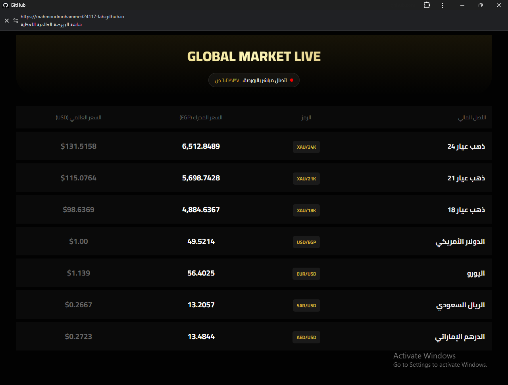

#📈 Global Marketing Live


## 🌐 Live Demo

👉 **[View Live Demo](https://mahmoudmohammed24117-lab.github.io/Global-Marketing-live/)**


### 📸 Preview

<p align="center">
  
</p>

A modern and responsive **Global Marketing Landing Page** built with **HTML5, CSS3, and JavaScript**. The project demonstrates a clean user interface, responsive design, and interactive web components for a professional marketing website.

## ✨ Features

* 🌍 Modern Marketing Landing Page
* 📱 Fully Responsive Design
* ⚡ Interactive User Experience
* 🎨 Clean and Professional UI
* 🚀 Fast Performance
* 💡 Modern Layout
* 🖱 Smooth Hover Effects

## 🛠 Technologies Used

* HTML5
* CSS3
* JavaScript (ES6)

## 📂 Project Structure

```text
Global-Marketing-live/
│
├── index.html
├── style.css
└── main.js
```

## 🚀 Getting Started

### 1. Clone the repository

```bash
git clone https://github.com/mahmoudmohammed24117-lab/Global-Marketing-live.git
```

### 2. Open the project folder

### 3. Open `index.html` in your browser

## 📸 Preview

Add screenshots of the project here.

## 🎯 Future Improvements

* Connect with a backend API.
* Add animations using GSAP or AOS.
* Improve SEO.
* Optimize loading performance.
* Add Dark Mode.

## 👨‍💻 Developer

**Mahmoud Mohamed Nagm**

Front-End Developer

## 📧 Contact

Email: **[mahmoud.mohammed.24117@gmail.com](mailto:mahmoud.mohammed.24117@gmail.com)**

GitHub: **https://github.com/mahmoudmohammed24117-lab**

---

⭐ If you found this project useful, consider giving it a star.
